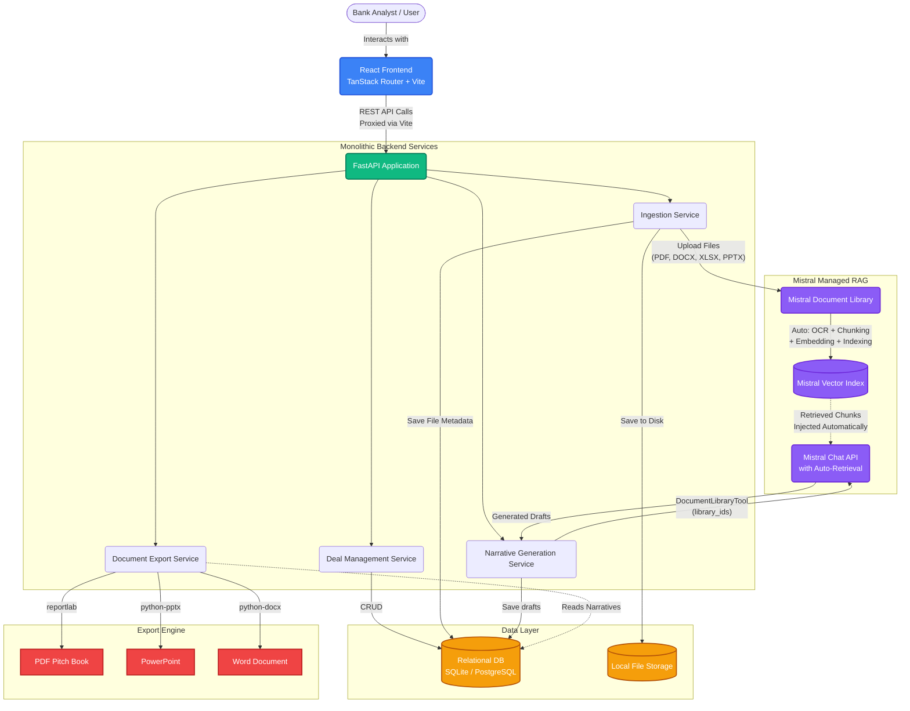
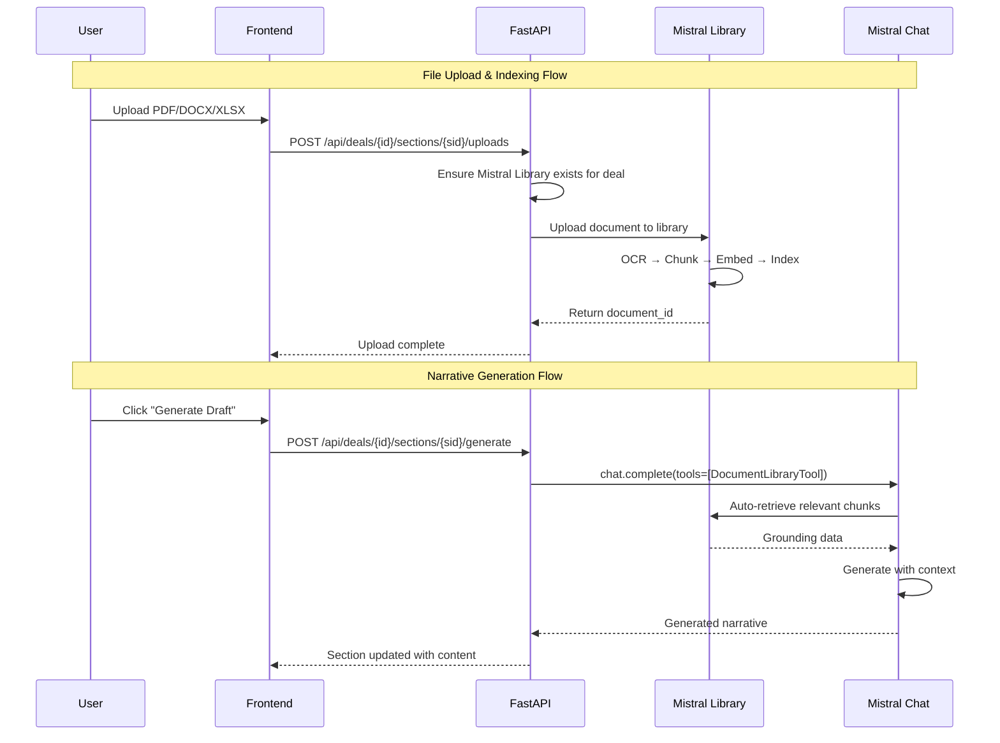

# System Architecture

The following diagram illustrates the high-level architecture of the Credit Dossier platform, using **Mistral's Document Library** for fully managed RAG.

## How Mistral Document Library Works

## Key Design Decisions

### Why Mistral Document Library over ChromaDB?

| Aspect | ChromaDB (Previous) | Mistral Document Library (Current) |
|---|---|---|
| **Setup** | Self-hosted vector DB, manual embedding | Zero-config, fully managed |
| **OCR** | Manual text extraction per format | Mistral OCR handles all formats |
| **Chunking** | Custom chunking logic | Automatic, optimized chunking |
| **Embedding** | Separate API calls to mistral-embed | Handled internally |
| **Retrieval** | Manual query + inject into prompt | Automatic via DocumentLibraryTool |
| **Maintenance** | Manage ChromaDB storage, backups | Cloud-managed by Mistral |

### Per-Deal Library Isolation
Each deal gets its own Mistral Document Library (`mistral_library_id` on the Deal model). This ensures:
- Documents from Deal A never leak into Deal B's generation
- Library cleanup when a deal is deleted
- Clear audit trail of which documents ground which narratives
