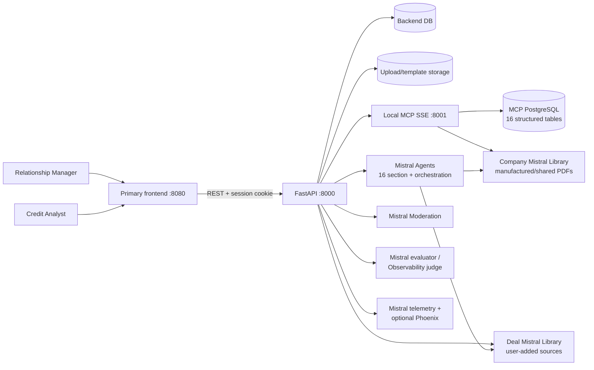
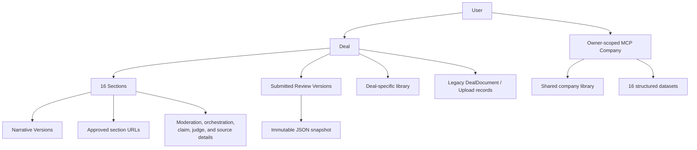
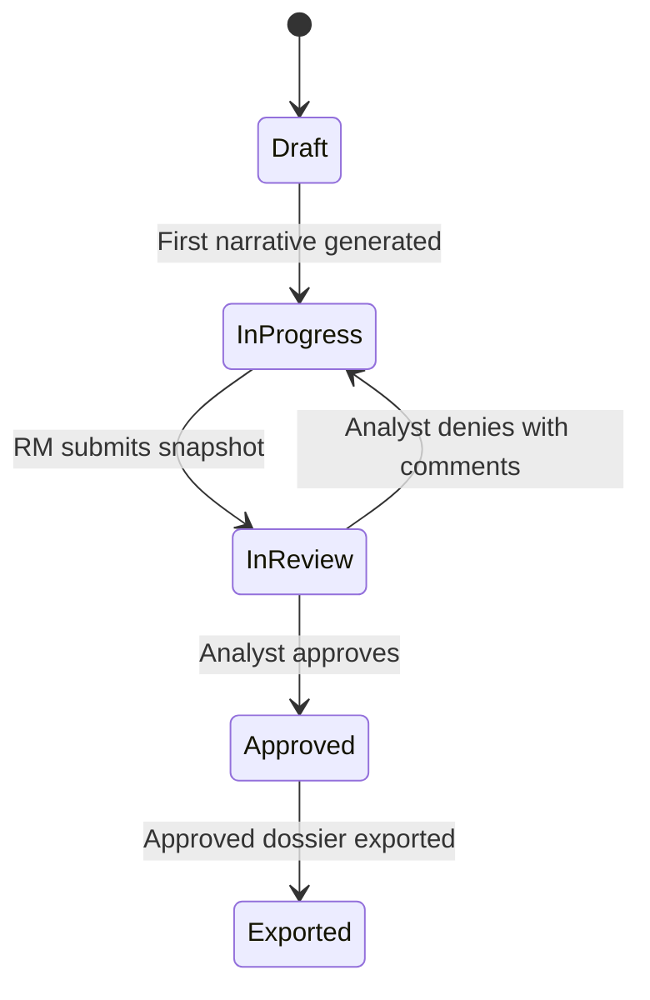

# Credit Dossier Architecture

This document describes the current architecture. Credit Dossier is a FastAPI monolith with one React client, a local credit-intelligence MCP, Mistral-managed agents and document libraries, and relational persistence.

## System context



## Component responsibilities

| Component | Responsibilities |
|---|---|
| `frontend/` | Primary authenticated UI for deals, narratives, sources, version review, exports, profile, and observability |
| `backend/app/routers/` | HTTP boundary, validation, session/role enforcement, streaming downloads |
| `backend/app/services/` | Deal workflow, ingestion, library sync, orchestration, generation, moderation, evaluation, versions, exports, MCP calls, and URL scraping |
| `backend/app/agents/` | Section instructions, orchestration prompts, registry, and 16 section agent definitions |
| Backend database | Users/sessions, deals/sections, audit entries, review versions, narrative history, library metadata, and sync logs |
| `mcp/` | Owner-scoped company discovery, structured-data queries, PDF/library access, and synthetic-data manufacturing |
| Mistral Document Libraries | Managed OCR/indexing/retrieval for shared company documents and deal-specific documents |

## Authentication and authorization

Passwords are stored as PBKDF2-SHA256 hashes. Raw session tokens are returned only as HTTP-only cookies; only SHA-256 token hashes are persisted. Relationship Manager and Credit Analyst sessions expire after 30 minutes; Administrator sessions expire after 15 minutes. These are absolute lifetimes, enforced by both cookie lifetime and server-side session validation.

Every backend HTTP request creates an application-level append-only audit record containing event ID, UTC
timestamp, source IP, user ID, resource ID, category, event type, HTTP status, outcome,
and message. Authenticated administrator API activity is maintained separately with
the `administrative_action` category. Normal and failed non-administrative activity is
categorized as `user_event`; HTTP 5xx responses, unhandled exceptions, and Python
error-level runtime/background logs are categorized as `system_error` with outcome
`error`. Only Administrators can read the complete trail.

The frontend and backend use one HTTP-only session cookie.

Authorization is enforced in backend dependencies:

| Capability | Relationship Manager | Credit Analyst | Administrator |
|---|---:|---:|---:|
| List/read deals | Own deals | All deals | No |
| Create and submit deals | Yes | No | No |
| Edit/generate/export accessible deals | Own deals | All deals | No |
| Approve or deny submitted versions | No | Yes | No |
| Configure password policy | No | No | Yes |

Company/MCP queries are also owner-scoped so clients with the same company name do not cross user boundaries.

## Data and library ownership



Each deal stores two library references:

- `company_mistral_library_id` points to the read-only company library resolved through MCP. It can be shared by multiple deals for the same owner/company.
- `mistral_library_id` points to sources uploaded specifically to the deal.

Generation attaches both available library IDs to the global agents inside a lock-protected scope. The lock prevents another request from changing shared agent library bindings during a generation run.

Legacy `DealDocument`, `SectionDocumentLink`, and section `Upload` records remain supported. They provide OCR/direct-extraction compatibility, while current Library RAG uses `LibraryFile` metadata and Mistral libraries as the primary document path.

## Narrative generation pipeline

```mermaid
sequenceDiagram
    participant U as User
    participant API as FastAPI
    participant MOD as Moderation
    participant MCP as Local MCP
    participant ORCH as Orchestration agent
    participant SRC as Libraries + URLs + tables
    participant AG as Section agent
    participant EV as Evaluators
    participant DB as Backend DB

    U->>API: Generate section(s)
    API->>MOD: Check custom instructions/template
    alt Input is flagged
        MOD-->>API: Categories and scores
        API-->>U: Reject generation
    else Input is safe or absent
        API->>MCP: Fetch cached summaries and structured tables
        API->>ORCH: Rank documents and data points
        ORCH-->>API: Strategy, queries, gaps, confidence
        API->>SRC: Scope company + deal libraries; scrape approved URLs
        API->>AG: Deal context + selected tables + strategy + web context
        AG->>SRC: Document-library retrieval
        AG-->>API: Markdown narrative with source markers
        API->>EV: Claim classification and confidence evaluation
        EV-->>API: Score, claim counts, details, metrics
        API->>DB: Save content, narrative version, sources, metrics, and audit entry
        API-->>U: Narrative and evaluation result
    end
```

The context assembler selects only the deal fields and PostgreSQL table families relevant to the section. Section URLs are validated and capped at 10, then fetched with the URL scraper. Grounding input is size-limited by `MAX_GROUNDING_CHARS`.

"Draft all" reuses cached MCP summaries and structured data across the batch. Orchestration and generation have separate semaphores (`ORCHESTRATION_SEMAPHORE` and `GENERATION_SEMAPHORE`), and the API exposes a background job with per-section progress.

If MCP is unavailable, startup and generation degrade gracefully: orchestration receives no external summaries, while available deal/company libraries and manual URLs can still be used.

## Evaluation, sources, and observability

After generation, the backend stores:

- orchestration strategy, selected documents, gaps, confidence, latency, and token counts;
- moderation status and category details when custom inputs are present;
- retrieved source/citation metadata from Mistral responses;
- grounded, inferred, and unsupported claim counts from the claim evaluator;
- a normalized confidence score from `MISTRAL_ACCURACY_JUDGE_ID`, when configured, with the legacy evaluator score as fallback;
- per-stage observability metrics for moderation, orchestration, section generation, claim evaluation, and confidence judging.

Mistral telemetry uses redaction. Phoenix/OpenInference instrumentation can export the same runtime to a configured Phoenix collector. The `/observability` frontend route also derives trace and agent summaries from the persisted section details and can export them as JSON.

## Review and export lifecycle



Narrative history and deal-review versions are separate concepts:

- A `NarrativeVersion` records each generated or manually edited section result. One version may be marked final, and versions can be removed with a safe fallback to remaining/current content.
- A deal `Version` freezes deal metadata and all section content at submission time in `snapshot_json`. Downloading that version renders its snapshot, so later edits do not change the submitted PDF. Older rows without snapshots are reconstructed from narrative history up to the submission timestamp.

Current exports render the accessible deal as PDF, DOCX, or PPTX. A separate combined-report endpoint returns PDF. Theme extraction can derive a palette from an uploaded reference document.

## Startup and shutdown

Backend startup performs the following operations:

1. Initializes Mistral and optional Phoenix telemetry.
2. Creates missing ORM tables and applies safe additive column migrations.
3. Seeds configured initial role accounts and backfills legacy deal owners.
4. Resets interrupted library-sync records.
5. Connects to MCP without making availability a startup requirement.
6. Creates/reuses the 16 global section agents and one orchestration agent.

Shutdown removes the temporary global Mistral agents/connectors and disconnects the MCP client.

## Security and operational boundaries

- API authentication and deal authorization are server-side; frontend route guards are convenience only.
- Mistral telemetry is configured with redaction for financial content.
- URL sources are explicitly stored per section and validated before scraping.
- MCP caching has a TTL and circuit breaker to limit repeated failures.
- PostgreSQL is the only supported application database; backend and MCP data remain separated.
- Local file storage is suitable for development. Production deployment should use durable object storage, managed secrets, HTTPS/secure cookies, controlled CORS origins, and a real migration/deployment process.
