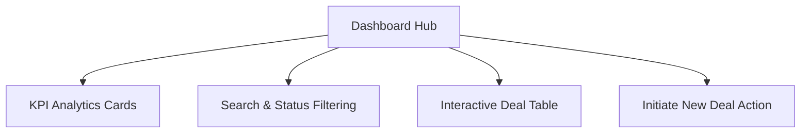
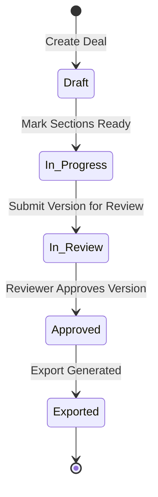

# Credit Pitch Book Pipeline - UI Feature Specification

Welcome to the **Credit Pitch Book Pipeline** interface documentation. This application is a specialized platform designed for banking Relationship Managers (RMs), Credit Analysts, and Reviewers to initiate, draft, validate, review, and export comprehensive credit pitch books with complete traceability and AI-assisted drafting.

---

## 1. Executive Dashboard (Pipeline View)

The Dashboard serves as the central hub for tracking active deals, monitoring progress, and filtering key portfolios.



### Key UI Features

#### **A. KPI Summary Analytics Cards**
Located at the top of the dashboard, these cards provide an aggregated snapshot of the pipeline:
*   **Total Deals**: The total count of deals currently tracked in the local data store.
*   **Active Drafts**: Count of deals with `Draft` or `In Progress` status.
*   **In Review**: Count of deals that have been submitted to credit reviewers.
*   **Approved/Exported**: Count of finalized deals ready for corporate presentations or already exported.

#### **B. Global Pipeline Search & Filter Bar**
*   **Customer Search**: An instant text-input search that filters the pipeline table in real-time by customer legal name.
*   **Status Dropdown Filter**: Allows users to filter deals by status: `All Statuses`, `Draft`, `In Progress`, `In Review`, `Approved`, or `Exported`.

#### **C. Deal Pipeline Table**
A rich table designed to present critical metadata at a glance:
*   **Customer Column**: Displays the company's legal name, sector, and location (City, Country).
*   **Type & Segment Badges**: Curated status indicators showing if the customer is `Existing` or `New-to-bank` using color-coded tags.
*   **Facility & Amount**: Displays the facility type (e.g., Term Loan, Working Capital) and the formatted financial exposure in Crores for INR (e.g., `INR 25.00 Cr`) or standard format for other currencies.
*   **Progress Indicator**: A visual progress bar detailing the completion percentage of mandatory pitch book sections (e.g., `5/12 sections completed`).
*   **Status Badge**: High-contrast, pill-shaped badges for active status visualization.
*   **Open Details Action**: Navigation link to load the selected deal’s detailed workspace.

---

## 2. New Deal Initiation Workspace

The Deal Initiation interface is a structured form split into logical categories for setting up a credit proposal.

### Form Sections & Fields

| Section | Field Name | Type / Options | Description |
| :--- | :--- | :--- | :--- |
| **Customer Details** | **Legal Name** | Text Input (Required) | The registered business name (e.g., *Ujwal Industries Pvt Ltd*). |
| | **Customer Type** | Dropdown | `Existing` or `New-to-bank`. |
| | **Industry** | Text Input | Sector classification (e.g., *Auto Components*). |
| | **Segment** | Dropdown | `SME`, `Mid Corporate`, or `Large Corporate`. |
| | **Geography** | Text Input | Location of operations (e.g., *Pune, India*). |
| | **KYC Status** | Dropdown | `Verified` or `Pending`. |
| **Facility Details** | **Facility Type** | Dropdown | `Term Loan`, `Working Capital`, or `Syndicated Loan`. |
| | **Currency** | Dropdown | `INR`, `USD`, `EUR`, or `GBP`. |
| | **Amount** | Number Input | Facility limit in base currency units. |
| | **Tenure** | Number Input | Loan duration in months. |
| | **Pricing** | Text Input | Interest rate terms (e.g., *Repo + 285 bps*). |
| | **Repayment** | Text Input | Amortization schedule details. |
| | **Collateral** | Dropdown | `Yes` (Secured) or `No (Clean)`. |
| | **Target Date** | Date Picker | Expected date for pipeline completion. |

---

## 3. Deal Detail & Editing Workspace

Once a deal is selected, the interface loads a tabbed workspace containing four core tabs.

```
+-------------------------------------------------------------------------+
| [<- Back to Dashboard]  Company Name (Sector / City)   Exposure amount  |
+-------------------------------------------------------------------------+
|  [ Overview ]      [ Narratives ]      [ Versions ]      [ Export ]     |
+-------------------------------------------------------------------------+
```

### Tab 1: Overview
Presents a dashboard-within-a-dashboard summarizing the health of the specific transaction.
*   **Client & Facility Snapshot**: A grid layout displaying all core client and transaction metadata.
*   **Readiness Panel**: Displays the percentage of completed sections, policy checks (failures/warnings), number of versions submitted, and active alerts.
*   **Recent Activity Log**: An audit trail showing the timeline of actions, changes, authors, and timestamps.

### Tab 2: Narratives (The Drafting Canvas)
The primary workspace where the actual credit pitch book is constructed. It contains a left-side section sidebar and a right-side drafting panel.

#### **A. Left Sidebar (Section List)**
Lists the 16 standard sections of a corporate credit proposal:
1.  *Executive Summary*
2.  *Client Overview*
3.  *Relationship Summary*
4.  *Industry Analysis*
5.  *Financial Analysis*
6.  *Ratio Analysis*
7.  *Cash Flow Analysis*
8.  *Qualitative Assessment*
9.  *Credit Risk Assessment*
10. *Facility Structure*
11. *Policy Mapping*
12. *Collateral and Security*
13. *Covenants and Conditions* (Optional)
14. *ESG Analysis* (Optional)
15. *Key Risks and Mitigants* (Optional)
16. *Appendix* (Optional)

#### **B. Right Panel (Section Workspace)**
For the active section, the following cards are provided:
*   **Information Details**: Description of the section, required ground truth data sources, and default expected output rules.
*   **Inputs Grounding Panel**: A tool to upload supporting documents (Files, URLs, or Text inputs) that the AI should analyze to draft the section.
*   **Expected Output Specifier**: A text area where the user can customize instructions for the AI draft (e.g., specifying tone, level of detail, or required figures).
*   **Generated Narrative Sandbox**: A simulated AI text generator. Clicking "Generate" simulates an AI run, drafts the text, and marks the section as `ready`, updating the global completion progress bar.

### Tab 3: Versions (Verification & Review)
Manages the validation, auditing, and approval workflow.
*   **Validation Summary**: Shows if any mandatory sections are still missing, or if any policy guidelines are violated.
*   **Submit for Review**: Allows the analyst to add comments (e.g., explaining deviations) and freeze the current draft into a version.
*   **Version History Table**: Chronologically lists all frozen versions with notes and timestamps.
*   **Full Audit Trail**: Displays every action performed on this deal from inception.

### Tab 4: Export Workspace
Controls the output generation of the final pitch book.
*   **Export Blockers**: If the document lacks approval or has incomplete mandatory sections, the interface explicitly displays alert messages detailing the missing requirements.
*   **Format Selection**: Buttons to export the completed document into standard formats (`PPT`, `PDF`, `DOCX`).

---

## 4. Status Transition Lifecycle

The deal moves through five predefined statuses, controlled by validation checks:



---

## 5. UI Styling & Theme Tokens

The application employs a curated modern design language utilizing CSS variables with HSL/OKLCH color models:

*   **Primary color**: `oklch(0.32 0.13 258)` (A premium Deep Indigo/Slate Blue)
*   **Surface Color**: `oklch(0.975 0.005 250)` (A soft, off-white background)
*   **Borders**: Subtle `oklch(0.92 0.012 255)` line styling for a clean, borderless appearance.
*   **Typography**: Clean sans-serif font stack with tabular-num formatting for monetary columns to ensure alignment.
*   **Responsive Adaptation**: Automatic transformation of large tables to simplified list-cards for mobile views.
