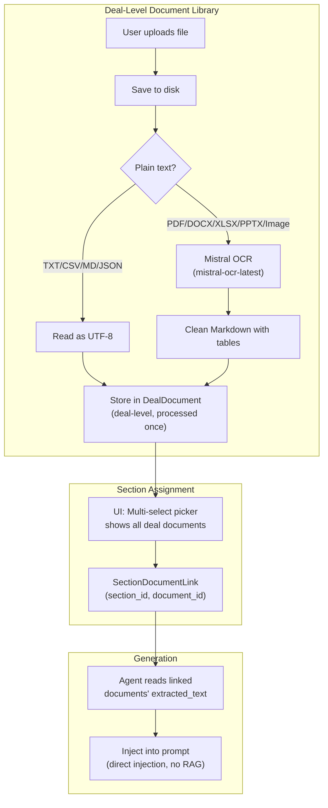

# Upgrade Plan: Mistral OCR + Deal-Level Document Library

## Goal

Two linked upgrades to maximize report accuracy and eliminate redundant processing:

1. **Mistral OCR Ingestion** — Replace PyPDF2/python-docx with `mistral-ocr-latest` for perfectly formatted Markdown tables and scanned document support
2. **Deal-Level Document Library** — Documents are uploaded once at the deal level, then *assigned* to sections via a multi-select picker. No re-processing when the same document is used in multiple sections.

---

## Architecture



---

## Proposed Changes

### 1. Database Models

#### [NEW] `DealDocument` model — Deal-level document store

```python
# backend/app/models/document.py

class DealDocument(Base):
    """A document uploaded to a deal. Processed once, reusable across sections."""
    __tablename__ = "deal_documents"

    id          = Column(String(64), primary_key=True, default=...)
    deal_id     = Column(ForeignKey("deals.id", ondelete="CASCADE"))
    
    source_type = Column(String(16))        # file | url | text
    filename    = Column(String(512))       # Original filename
    file_path   = Column(String(1024))      # Path on disk
    file_hash   = Column(String(64))        # SHA-256 hash for dedup
    url         = Column(String(2048))
    text_content= Column(Text)              # For source_type="text"
    note        = Column(Text)
    
    # OCR-extracted content (the gold — processed once)
    extracted_text = Column(Text)
    extraction_method = Column(String(32))  # "mistral_ocr" | "local_fallback" | "plain_text"
    page_count = Column(Integer)            # Number of pages (from OCR)
    
    created_at  = Column(DateTime, default=_now)
    
    # Relationships
    deal = relationship("Deal", back_populates="documents")
    section_links = relationship("SectionDocumentLink", back_populates="document", cascade="all, delete-orphan")
```

#### [NEW] `SectionDocumentLink` — Junction table linking sections to documents

```python
class SectionDocumentLink(Base):
    """Links a deal document to a section. Many-to-many."""
    __tablename__ = "section_document_links"

    id          = Column(String(64), primary_key=True, default=...)
    section_id  = Column(ForeignKey("sections.id", ondelete="CASCADE"))
    document_id = Column(ForeignKey("deal_documents.id", ondelete="CASCADE"))
    created_at  = Column(DateTime, default=_now)
    
    # Unique constraint: a document can only be linked once per section
    __table_args__ = (UniqueConstraint("section_id", "document_id"),)
    
    section  = relationship("Section", back_populates="document_links")
    document = relationship("DealDocument", back_populates="section_links")
```

#### [MODIFY] [deal.py](file:///c:/Users/MrHarshGurjar/Desktop/code/Credit_Dossier/backend/app/models/deal.py)

- Add `documents` relationship to `Deal` model
- Add `document_links` relationship to `Section` model
- Keep the old `uploads` relationship temporarily for backward compatibility

#### [MODIFY] [upload.py](file:///c:/Users/MrHarshGurjar/Desktop/code/Credit_Dossier/backend/app/models/upload.py)

- Mark as deprecated (we'll migrate away from it)

---

### 2. Schemas

#### [MODIFY] [deal.py (schemas)](file:///c:/Users/MrHarshGurjar/Desktop/code/Credit_Dossier/backend/app/schemas/deal.py)

```python
# New schemas
class DealDocumentResponse(BaseModel):
    id: str
    source_type: str
    filename: str | None
    url: str | None
    note: str | None
    extraction_method: str | None
    page_count: int | None
    created_at: datetime
    
    model_config = {"from_attributes": True}

class SectionDocumentLinkResponse(BaseModel):
    id: str
    document: DealDocumentResponse  # Nested — shows document info
    created_at: datetime
    
    model_config = {"from_attributes": True}

# Update SectionResponse
class SectionResponse(BaseModel):
    # ... existing fields ...
    document_links: list[SectionDocumentLinkResponse] = []  # NEW
    uploads: list[UploadBrief] = []  # Keep for backward compat
```

---

### 3. Ingestion Service — Mistral OCR Upgrade

#### [MODIFY] [ingestion_service.py](file:///c:/Users/MrHarshGurjar/Desktop/code/Credit_Dossier/backend/app/services/ingestion_service.py)

Major rewrite:

**New function: `extract_text_with_mistral_ocr()`**
```python
async def extract_text_with_mistral_ocr(file_bytes: bytes, filename: str) -> tuple[str, int]:
    """
    Use Mistral OCR for high-accuracy text extraction.
    Returns (extracted_markdown, page_count).
    """
    client = _get_mistral()
    
    # 1. Upload to Mistral file storage
    uploaded = await client.files.upload_async(
        file={"file_name": filename, "content": file_bytes},
        purpose="ocr"
    )
    
    # 2. Process with OCR
    ocr_response = await client.ocr.process_async(
        model="mistral-ocr-latest",
        document={"type": "file_id", "file_id": uploaded.id},
    )
    
    # 3. Concatenate all pages
    pages_md = []
    for i, page in enumerate(ocr_response.pages):
        pages_md.append(f"<!-- Page {i+1} -->\n{page.markdown}")
    
    result = "\n\n".join(pages_md)
    page_count = len(ocr_response.pages)
    
    # 4. Cleanup temp file
    try:
        await client.files.delete_async(file_id=uploaded.id)
    except Exception:
        pass
    
    return result, page_count
```

**New function: `process_deal_document()`** — replaces the old section-level functions
```python
async def process_deal_document(
    db: Session,
    deal_id: str,
    file_bytes: bytes,
    filename: str,
    source_type: str,
    note: str | None = None,
    url: str | None = None,
    text_content: str | None = None,
) -> DealDocument:
    """Process and store a document at deal level."""
    
    # 1. Check for duplicate (same hash in this deal)
    file_hash = hashlib.sha256(file_bytes).hexdigest()
    existing = db.query(DealDocument).filter(
        DealDocument.deal_id == deal_id,
        DealDocument.file_hash == file_hash
    ).first()
    if existing:
        return existing  # Skip re-processing!
    
    # 2. Save to disk
    file_path = await save_file(file_bytes, filename, deal_id)
    
    # 3. Extract text
    ext = Path(filename).suffix.lower()
    if ext in (".txt", ".md", ".csv", ".json"):
        extracted = file_bytes.decode("utf-8", errors="replace")
        method = "plain_text"
        page_count = 1
    elif ext in (".pdf", ".docx", ".xlsx", ".pptx", ".png", ".jpg", ".jpeg"):
        try:
            extracted, page_count = await extract_text_with_mistral_ocr(file_bytes, filename)
            method = "mistral_ocr"
        except Exception as e:
            logger.error(f"OCR failed, falling back: {e}")
            extracted = _local_fallback_extract(file_bytes, filename)
            method = "local_fallback"
            page_count = 0
    else:
        extracted = f"[Unsupported: {ext}]"
        method = "unsupported"
        page_count = 0
    
    # 4. Create DealDocument record
    doc = DealDocument(
        deal_id=deal_id,
        source_type=source_type,
        filename=filename,
        file_path=file_path,
        file_hash=file_hash,
        url=url,
        text_content=text_content,
        note=note,
        extracted_text=extracted[:200_000],  # Generous limit
        extraction_method=method,
        page_count=page_count,
    )
    db.add(doc)
    db.commit()
    db.refresh(doc)
    return doc
```

**Remove:** `ensure_deal_library()`, `upload_to_mistral_library()`, `delete_from_mistral_library()` (Mistral Library upload is no longer needed since we're doing direct OCR + prompt injection)

---

### 4. API Endpoints

#### [NEW] Deal Documents Router — `backend/app/routers/documents.py`

| Method | Path | Description |
|--------|------|-------------|
| `POST` | `/api/deals/{deal_id}/documents` | Upload a new document to the deal (triggers OCR) |
| `GET` | `/api/deals/{deal_id}/documents` | List all documents in the deal |
| `DELETE` | `/api/deals/{deal_id}/documents/{doc_id}` | Delete a deal document |
| `POST` | `/api/deals/{deal_id}/sections/{section_id}/documents/link` | Link existing document(s) to a section |
| `DELETE` | `/api/deals/{deal_id}/sections/{section_id}/documents/{doc_id}/unlink` | Unlink a document from a section |

**Link endpoint** accepts a list of document IDs:
```python
@router.post("/{section_id}/documents/link")
async def link_documents(
    deal_id: str,
    section_id: str,
    body: LinkDocumentsRequest,  # { document_ids: ["doc_xxx", "doc_yyy"] }
    db: Session = Depends(get_db),
):
    """Assign existing deal documents to a section. No re-processing."""
    # Create SectionDocumentLink entries
    ...
```

#### [MODIFY] [uploads.py](file:///c:/Users/MrHarshGurjar/Desktop/code/Credit_Dossier/backend/app/routers/uploads.py)

- Keep existing endpoints for backward compatibility
- Mark as deprecated — new uploads go through `/documents`

---

### 5. Narrative Service — Use New Document Links

#### [MODIFY] [narrative_service.py](file:///c:/Users/MrHarshGurjar/Desktop/code/Credit_Dossier/backend/app/services/narrative_service.py)

```python
MAX_GROUNDING_CHARS = 80_000  # Increase from 30k (OCR text is cleaner/more compact)

@staticmethod
def _get_section_grounding(section: Section) -> str | None:
    """Collect grounding data from documents linked to this section."""
    # NEW: Use document_links instead of uploads
    if not section.document_links:
        # Fallback: check old uploads for backward compat
        if not section.uploads:
            return None
        return NarrativeService._get_legacy_grounding(section)
    
    parts = []
    for link in section.document_links:
        doc = link.document
        if doc.extracted_text:
            label = doc.filename or doc.url or "Text input"
            method = f" [{doc.extraction_method}]" if doc.extraction_method else ""
            parts.append(f"[Document: {label}{method}]\n{doc.extracted_text}")
    
    if not parts:
        return None
    
    combined = "\n\n---\n\n".join(parts)
    if len(combined) > MAX_GROUNDING_CHARS:
        combined = combined[:MAX_GROUNDING_CHARS] + "\n\n[... truncated ...]"
    
    return combined
```

---

### 6. Frontend UI — Multi-Select Document Picker

#### [MODIFY] [deals.$dealId.tsx](file:///c:/Users/MrHarshGurjar/Desktop/code/Credit_Dossier/frontend/src/routes/deals.$dealId.tsx)

Replace the current "Add Document" form with a two-mode interface:

**Mode 1: "Select Existing" tab** — Multi-select checkbox list of all deal documents
```
┌─────────────────────────────────────────────────┐
│ 📦  SECTION DOCUMENTS                [+ Add]   │
├─────────────────────────────────────────────────┤
│ ┌─ Select Existing ─┐┌─ Upload New ─┐          │
│ │                    ││              │          │
│ ╔═══════════════════════════════╗               │
│ ║ ☑ FY24_Annual_Report.pdf  📄 ║  ← already   │
│ ║   [mistral_ocr] • 42 pages   ║    linked     │
│ ║ ☐ Balance_Sheet.xlsx      📊 ║  ← available  │
│ ║   [mistral_ocr] • 3 pages    ║               │
│ ║ ☑ Management_Letter.docx  📝 ║  ← already   │
│ ║   [mistral_ocr] • 12 pages   ║    linked     │
│ ╚═══════════════════════════════╝               │
│ [ Save Selection ]                              │
└─────────────────────────────────────────────────┘
```

**Mode 2: "Upload New" tab** — Same upload form as now (file/URL/text), but uploads go to deal level first, then auto-links to this section.

#### [MODIFY] [deals.ts](file:///c:/Users/MrHarshGurjar/Desktop/code/Credit_Dossier/frontend/src/lib/deals.ts)

Add new API methods:
```typescript
// New types
interface DealDocument {
  id: string;
  source_type: string;
  filename: string | null;
  url: string | null;
  note: string | null;
  extraction_method: string | null;
  page_count: number | null;
  created_at: string;
}

// New API methods
documents: {
  list: (dealId: string) => ...,
  upload: (dealId: string, formData: FormData) => ...,
  delete: (dealId: string, docId: string) => ...,
  linkToSection: (dealId: string, sectionId: string, documentIds: string[]) => ...,
  unlinkFromSection: (dealId: string, sectionId: string, docId: string) => ...,
},
```

---

## What Stays the Same

| Component | Status |
|-----------|--------|
| Agent architecture (16 section agents) | ✅ No change |
| Direct prompt injection (no RAG tools) | ✅ No change |
| Zero-shot / Few-shot switching | ✅ No change |
| Output templates | ✅ No change |
| Base agent prompt construction | ✅ Minor wording update only |

---

## Migration Strategy

Since we use SQLite without Alembic:
1. **New tables** (`deal_documents`, `section_document_links`) are created automatically by `Base.metadata.create_all()`
2. **Old `uploads` table** stays in place — backward compatible
3. The narrative service checks `document_links` first, falls back to `uploads`
4. We can migrate old uploads to deal documents in a future step

---

## Verification Plan

### Manual Testing
1. Upload a complex financial PDF → verify OCR extracts clean Markdown with tables
2. Upload same PDF to a different section → verify it's not re-processed (hash match)
3. Use "Select Existing" to assign a document to multiple sections
4. Generate a section → verify OCR-quality text appears in grounding data
5. Upload a scanned PDF → verify OCR works on images

### Automated
```bash
# Verify OCR extraction
python -c "
from app.services.ingestion_service import extract_text_with_mistral_ocr
import asyncio
with open('test.pdf', 'rb') as f:
    text, pages = asyncio.run(extract_text_with_mistral_ocr(f.read(), 'test.pdf'))
print(f'Pages: {pages}')
print(text[:2000])
"
```
